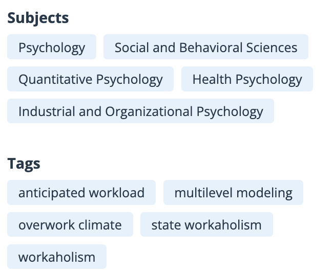
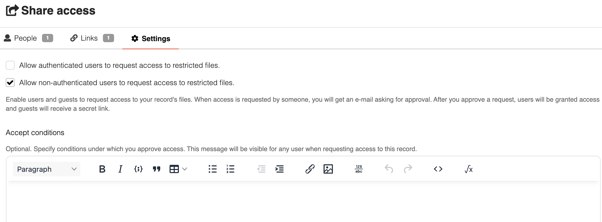
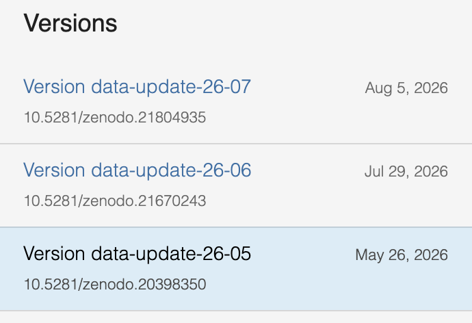

::: {.visually-hidden}
Parole chiave: FAIR findable accessible interoperable reusable trovabile accessibile interoperabile riusabile principi; DMP data management plan piano gestione Horizon Europe finanziamento template.
:::

*Come faccio in modo che questo lavoro sia utilizzabile da qualcuno che
non può chiedermi niente?*

## Quanto siete FAIR?

-   [ ] Esiste un identificatore persistente (DOI) per i dati/progetto,
    non solo per l'articolo?
-   [ ] Una persona esterna può scaricare i vostri
    dati/materiali/script?
-   [ ] I file sono in formati aperti (CSV, TXT, JSON) e non solo
    `.xlsx`?
-   [ ] Ogni colonna di ogni file è documentata da qualche parte?
-   [ ] C'è una licenza esplicita? E differenziata per dati, script e
    materiali?
-   [ ] Si capisce quali script hanno prodotto quali risultati, e in che
    ordine vanno eseguiti?
-   [ ] Dataset, codice, preregistrazione e articolo sono collegati
    l'uno all'altro?

## Da dove vengono

I principi FAIR nascono da un articolo del 2016 su *Scientific Data*
(Wilkinson e colleghi,
[10.1038/sdata.2016.18](https://doi.org/10.1038/sdata.2016.18)), scritto
da un gruppo eterogeneo di ricercatori, editori, enti finanziatori e
informatici. L'idea di partenza è che l'enorme quantità di dati prodotti
dalla ricerca resta sostanzialmente inutilizzabile, non perché sia
segreta, ma perché è indescrivibile, introvabile e illeggibile per chi
non l'ha prodotta.

Oggi sono il riferimento esplicito per [Horizon
Europe](https://www.openaire.eu/how-to-comply-with-horizon-europe-mandate-for-rdm),
[ERC](https://erc.europa.eu/manage-your-project/open-science) e
[PRIN](https://www.mur.gov.it/sites/default/files/2026-04/D.D.%202298%20All.%203%20Linee%20Guida%20di%20valutazione.pdf).
In Italia il MUR li ha adottati nel [Piano Nazionale per la Scienza
Aperta
2021-2027](https://www.mur.gov.it/sites/default/files/2022-06/Piano_Nazionale_per_la_Scienza_Aperta.pdf),
dove si legge che **"Occorre promuovere la gestione FAIR quale standard
di riferimento nel processo di produzione dei risultati della ricerca
finanziata con risorse pubbliche"**.

::: {.callout-note title="FAIR4RS" collapse="true"}
Esiste anche una versione dei principi per il software, **FAIR4RS** ([Barker et al., 2022](https://doi.org/10.1038/s41597-022-01710-x)):
identificatore e versione, dipendenze dichiarate, licenza, istruzioni per eseguirlo.
:::

## I principi

### F — Findable {.principio}

Il repository alla pubblicazione **assegna un DOI** (per esempio
`10.5281/zenodo.XXXXXXX`), lo riporta nei metadati come identificatore
del deposito, ed espone i metadati agli aggregatori (via
[OAI-PMH](https://www.openarchives.org/pmh/), raccolti e indicizzati da
[OpenAIRE](https://explore.openaire.eu/)).

:::::: columns
::: {.column width="45%"}
Noi, in aggiunta, possiamo **compilare metadati ricchi** al caricamento:
titolo, autori con ORCID, descrizione e parole chiave (per esempio
"Stroop", "cognitive control"). Più il deposito è descritto, più è
trovabile.
:::

::: {.column width="10%"}
:::

::: {.column width="45%"}
{fig-align="center" width="300"}
:::
::::::

------------------------------------------------------------------------

### A — Accessible: *E' possibile ottenere i dati? Se sì, come?* {.principio}

Dal DOI si arriva ai file con un qualunque browser via HTTPS, senza
software aggiuntivo né abbonamenti; e se un **deposito** viene **ritirato**, il
**DOI continua** a funzionare e porta a una pagina che ne indica il motivo, al posto dei file.

Noi, in aggiunta, possiamo **scegliere il livello di accesso.** Se i dati sono sensibili si caricano con accesso *restricted*: la scheda descrittiva e il DOI restano pubblici, mentre i file sono accessibili solo alle persone approvate da chi ha depositato. L'accesso può essere limitato, purché la procedura per richiederlo sia pubblica.

{fig-align="center"}

------------------------------------------------------------------------

### I — Interoperable {.principio}

Salvare i dati in **formati aperti** (CSV invece di .xlsx). Un file che si apre solo con un programma specifico è già un ostacolo.

**Dare un significato esplicito ai dati.** Una tabella di soli numeri non dice cosa contiene: la colonna `score` un'accuratezza o il punteggio a un test. Si usa una forma strutturata, con intestazioni chiare, leggibile da [persone](struttura-1.qmd) e [macchine](struttura-2.qmd). **Usare i termini di un vocabolario condiviso** invece di sigle inventate.

:::::: columns
::: {.column width="45%"}
**Collegare i file fra loro** con relazioni dal nome preciso.
:::

::: {.column width="10%"}
:::

::: {.column width="45%"}
{fig-align="left" width="300"}
:::
::::::

------------------------------------------------------------------------

### R — Reusable {.principio}

**Documentare.** Un [README](struttura-1.qmd) che descrive lo studio e un [data dictionary](struttura-1.qmd) con una riga per ogni colonna dei dati.

**Dichiarare la [licenza](licenze.qmd).** In assenza di licenza valgono tutti i diritti riservati, e nessuno può riusare legalmente i dati.

**Indicare la provenienza** nel README: come sono stati raccolti e trattati i dati (e.g., "raccolti in laboratorio fra marzo").

**Seguire gli standard della disciplina**, se esistono:
[BIDS](https://bids.neuroimaging.io/) per il neuroimaging,
[Psych-DS](struttura-2.qmd) per i dati comportamentali,
[DDI](https://ddialliance.org/) per i questionari nelle scienze
sociali. Se non esistono, si usano gli stessi nomi, formati e codifiche in tutti i file.

## Data Management Plan (DMP)

Il [**DMP**](https://www.openaire.eu/rdm-glossary#data-management-plan) è un documento che si scrive **all'inizio** di un progetto e dice che dati produrrete, come li documenterete, dove li conserverete, con quale licenza e per quanto tempo. È un documento che può essere aggiornato man mano che il progetto procede, e gli scostamenti dal piano iniziale vanno documentati e motivati.

-   [**Catalogo dei
    template**](https://dmponline.rivm.nl/public_templates)
-   [**Il template ufficiale di Horizon
    Europe**](https://dmponline.rivm.nl/template_export/5992485.pdf)
-   [**Horizon Europe, annotato da
    Unipd**](https://biblio.unipd.it/biblioteca-digitale/per-chi-pubblica/documenti-e-materiali/unipd_dmp-guidelines_18-09-2024_v4-3.pdf),
    con spiegazioni ed esempi per ogni domanda.
-   [**Argos**](https://argos.openaire.eu/) (OpenAIRE),
    [**DMPonline**](https://dmponline.dcc.ac.uk/) e
    [**DMPTool**](https://dmptool.org/): strumenti online che guidano la
    compilazione.
